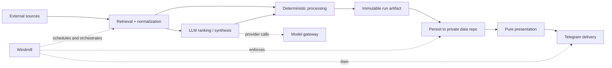

```text
██████╗   █████╗  ██╗ ██╗   ██╗   ██╗ ██████╗   █████╗  ███████╗ ██╗  ██╗
██╔══██╗ ██╔══██╗ ██║ ██║   ╚██╗ ██╔╝ ██╔══██╗ ██╔══██╗ ██╔════╝ ██║  ██║
██║  ██║ ███████║ ██║ ██║    ╚████╔╝  ██║  ██║ ███████║ ███████╗ ███████║
██║  ██║ ██╔══██║ ██║ ██║     ╚██╔╝   ██║  ██║ ██╔══██║ ╚════██║ ██╔══██║
██████╔╝ ██║  ██║ ██║ ███████╗ ██║    ██████╔╝ ██║  ██║ ███████║ ██║  ██║
╚═════╝  ╚═╝  ╚═╝ ╚═╝ ╚══════╝ ╚═╝    ╚═════╝  ╚═╝  ╚═╝ ╚══════╝ ╚═╝  ╚═╝
              Self-hosted market intelligence, orchestrated with Windmill

     deterministic data · ranked news · auditable LLM use · persisted artifacts
```

[](https://github.com/stefanrossmeier/daily-dash/actions/workflows/ci.yml)
[](https://www.python.org/)
[](LICENSE)

DailyDash is a self-hosted personal market-intelligence system. It collects market data,
news, prediction-market activity, Reddit signals, and selected X posts; applies deterministic
processing and narrowly scoped LLM ranking where it adds value; persists inspectable JSON
artifacts; and delivers compact Telegram reports on Windmill-managed schedules.

The repository is designed as a production-style portfolio project rather than a collection of
cron scripts: configuration is typed, prompts and deterministic policies are versioned assets,
model usage is routed through a gateway with cost traces, architectural boundaries are tested,
and the self-hosted Windmill environment can be reconstructed from files committed here.

**Start here:** [Quickstart](QUICKSTART.md) · [Architecture](docs/16_ARCHITECTURE_BOUNDARIES.md) ·
[Documentation](docs/README.md) · [Contributing](CONTRIBUTING.md) · [Security](SECURITY.md)

## What it runs

| Report | Primary input | LLM use | Purpose |
| --- | --- | --- | --- |
| Top News | mainstream/official RSS | ranking | market-relevant headline briefing with same-window ranked backfill |
| German News | German business/official RSS | ranking | Germany/Europe-oriented briefing |
| Alternative News | independent/market RSS | ranking | alternative-source market and macro briefing |
| Smart News | broad RSS context | thematic analysis | macro-theme clustering over a rolling context window |
| Markets | Yahoo Finance | none | weekday cross-asset snapshot |
| Futures | anonymous TradingView/tvDatafeed | none | 20-contract continuous-futures snapshot |
| Weekend Markets | IG public weekend quotes | none | weekend cross-asset snapshot |
| Yields | FRED, Bundesbank, ECB | none | sovereign/Euro-area yield snapshot |
| WSB | Reddit | ranking | market-moving retail signals plus bounded extreme activity |
| Polymarket | public Polymarket APIs | ranking for signals | prediction-market signals plus deterministic hot topics |
| X Watchlist | Grok native X Search | retrieval + ranking | high-recall scan of six curated market/macro accounts |

Schedules are declared in [`config/schedules.yaml`](config/schedules.yaml) and materialized as
versioned Windmill schedules. See [Scheduling](docs/SCHEDULING.md) for the current cadence and
retrieval-window semantics.

## Architecture



The production invariant is:

```text
run -> persist -> deliver
```

Windmill owns scheduling, orchestration, retries, worker routing, operational logs, and secret
injection. DailyDash owns retrieval, ranking/processing, contracts, persistence adapters,
presentation, and delivery adapters. Application pipelines never skip durable persistence to
send directly to Telegram.

The major code boundaries are intentionally explicit:

```text
src/daily_dash/
├── retrieval/      external acquisition and source normalization
├── llm/            model I/O and structured-response validation
├── processing/     deterministic domain logic
├── pipelines/      orchestration into immutable artifacts
├── storage/        artifact/data-repository persistence
├── presentation/   pure rendering
├── delivery/       external delivery adapters
└── commands/       runtime boundaries invoked by Windmill
```

Dependency-direction rules are enforced by contract tests. Stable prompts live under
`assets/prompts/`; substantive deterministic editorial policy can live under `assets/policies/`.
See [Architecture Boundaries](docs/16_ARCHITECTURE_BOUNDARIES.md).

## Repository and runtime boundaries

DailyDash deliberately separates source, private runtime state, and generated data:

```text
public source checkout
└── daily-dash/
    ├── src/                  application code
    ├── config/               profiles, source sets, schedules, model aliases
    ├── assets/               versioned prompts and deterministic policy assets
    ├── workflows/windmill/   workspace-as-code
    └── deploy/               reproducible deployment templates

private runtime directory
└── daily-dash-windmill-local/
    ├── .env                  non-secret Compose paths/settings
    └── secrets/              local one-value secret files

private data sink
└── daily-dash-data/
    └── ...                   immutable JSON report artifacts
```

`.venv/`, `node_modules/`, test/tool caches, local `.env`, ZIP snapshots, secrets, and runtime
state are ignored and are not part of the published repository. The root Node dependency is only
the pinned Windmill CLI used by developers/operators; the DailyDash application runtime is
Python.

## Quickstart

Requirements: Git, Python 3.12 via the repository-pinned `uv` toolchain, Node.js >20, npm,
Docker, and Docker Compose.

```bash
git clone https://github.com/stefanrossmeier/daily-dash.git
cd daily-dash
npm ci
./scripts/check-tools.sh
./scripts/check.sh
```

The full self-hosted setup also needs a private data sink, local secret files, a Windmill
workspace, and installation-specific variables. Follow [`QUICKSTART.md`](QUICKSTART.md) for the
complete sequence from clone to first flow run.

## Reproducible Windmill deployment

The local deployment is generated from [`deploy/local-windmill/`](deploy/local-windmill/) rather
than maintained as a second source repository:

```bash
./scripts/bootstrap-local-windmill.sh \
  --target ../daily-dash-windmill-local \
  --data-repo ../daily-dash-data

DAILY_DASH_WINDMILL_DIR=../daily-dash-windmill-local \
  ./scripts/local-windmill.sh up
```

Secrets are stored as one-value files in `daily-dash-windmill-local/secrets/`. They are never
committed to this repository. The model gateway reads the OpenRouter root key as a file secret;
other operational values are provisioned into Windmill with the repository helper scripts.

For the clean-machine procedure see
[Reproducing the local Windmill environment](docs/09_LOCAL_WINDMILL_BOOTSTRAP.md).

## Quality gate

The canonical repository gate is:

```bash
./scripts/check.sh
```

It synchronizes the locked Python environment, checks Ruff formatting/linting and strict mypy,
runs pytest with branch coverage, tests the model gateway, validates configuration, and verifies
the package build. CI executes the same gate.

Useful supporting checks:

```bash
npm ci
./scripts/check-tools.sh
./scripts/format.sh
git diff --check
```

## Model and cost discipline

Model-backed reports do not call providers directly. They use model aliases through the local
model gateway, which records the resolved provider/model, token usage, exact reported cost,
latency, retries, and prompt identity in persisted traces. Deterministic reports such as Markets,
Futures, Weekend Markets, and Yields do not use an LLM.

X Watchlist is a deliberate special case: Grok native X Search is the retrieval source itself,
then a separate cheap model performs semantic ranking.

## Data and privacy

This repository contains application code and configuration, not generated personal report data.
Production-style artifacts are persisted to a separate private Git repository before delivery.
Secrets live in the generated private runtime directory and/or Windmill secret storage.

Third-party source availability and terms remain the operator's responsibility. Some adapters use
public or unofficial interfaces and can change without notice. DailyDash is a personal information
tool, not a market-data redistribution service.

## Known limitations

- The current deployment model is self-hosted and primarily single-operator.
- Upstream RSS, public APIs, TradingView/tvDatafeed, and other third-party interfaces can fail or
  change independently of DailyDash.
- Git-backed artifact persistence is intentionally simple at the current data volume and may later
  be replaced by a database/object store.
- LLM ranking improves prioritization but is not treated as authoritative truth; raw candidates,
  structured decisions, and model traces remain inspectable.
- Market/news output is informational and is not investment advice.

## Documentation

The documentation index is [`docs/README.md`](docs/README.md). Good starting points are:

- [Quickstart](QUICKSTART.md)
- [Architecture Boundaries](docs/16_ARCHITECTURE_BOUNDARIES.md)
- [Windmill Orchestration](docs/05_WINDMILL_ORCHESTRATION.md)
- [Local Windmill Bootstrap](docs/09_LOCAL_WINDMILL_BOOTSTRAP.md)
- [Scheduling](docs/SCHEDULING.md)
- [Data Storage](docs/06_DATA_STORAGE.md)
- [Deployment Checklist](docs/15_DEPLOYMENT_CHECKLIST.md)

## Contributing and security

Contributions are welcome when they preserve DailyDash's architectural and operational
invariants. Read [`CONTRIBUTING.md`](CONTRIBUTING.md) before opening a pull request. Please report
security-sensitive issues according to [`SECURITY.md`](SECURITY.md), not in a public issue.

Community participation is covered by [`CODE_OF_CONDUCT.md`](CODE_OF_CONDUCT.md).

## License

Licensed under the [Apache License 2.0](LICENSE).
