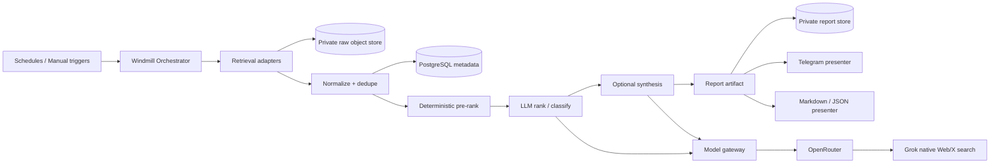

# DailyDash Modernization — Analysis and Target Architecture

**Status:** Architecture proposal  
**Date:** 2026-08-25  
**Input analyzed:** legacy DailyDash archive supplied on 2026-08-25

## 1. Executive conclusion

DailyDash should **not** be incrementally refactored into a cleaner version of the same design. The useful concepts should be extracted into a new public project beside the existing repository.

The new system should have four explicit boundaries:

1. **Retrieval** — acquire raw source material only.
2. **Processing** — normalize, deduplicate, score, rank and synthesize.
3. **Persistence** — store raw/derived runtime data outside the public code repository.
4. **Presentation** — turn a report artifact into Telegram, Markdown, JSON, a web view, or another delivery format.

A fifth component, **orchestration**, coordinates those four layers but must not contain the business logic itself.

The recommended implementation is a **code-first workflow architecture using Windmill** as the orchestrator, small Python pipeline components as the application, PostgreSQL plus private object storage as runtime state, and an internal model-gateway boundary. The first public release should focus only on the workflows that are most interesting as an AI/data portfolio project:

- Top News
- Alternative News
- German News
- Smart News / cross-source synthesis
- X / social pulse via Grok search rather than X scraping
- Polymarket
- WallStreetBets

The old markets, futures, yields, stress and macro jobs can remain in the legacy repository until there is a reason to migrate them.

## 2. What the current system actually is

The current project is a collection of independent report scripts behind Docker Compose services and host cron wrappers.

Typical execution is:

```text
host cron
  -> run_<job>.sh
      -> flock + timeout
      -> docker compose run <service>
          -> Python report script
              -> retrieve external data
              -> filter/score/process data
              -> format Telegram Markdown
              -> send Telegram message
```

The Telegram bot adds another execution path by launching report scripts as subprocesses.

This worked because it was simple, but it means the actual architecture is organized around **scripts**, not around **data products or pipeline stages**.

### 2.1 Current coupling

Most `report_*.py` files combine four responsibilities:

- provider-specific retrieval,
- transformation/ranking,
- report formatting,
- Telegram delivery.

That makes each report an integration endpoint instead of a reusable pipeline.

Examples from the archive:

- `report_news.py` fetches RSS, filters the time window, applies keyword scores, sorts, formats and sends.
- `report_news_alt.py` independently implements a more elaborate variation of the same RSS/ranking problem.
- `report_news_german.py` repeats much of the same structure again.
- `report_polymarket.py` performs retrieval, hand-written relevance classification, hotness ranking, formatting and sending.
- `report_wsb.py` fetches Reddit listings, computes a hand-written heat score, selects threads, extracts tickers and sends the message.
- `report_news_smart.py` is closer to the desired future structure because it creates an intermediate artifact and calls an LLM, but it is still a report-shaped program.

### 2.2 Scheduling is application-specific infrastructure

`crontab.txt` currently contains DailyDash schedules alongside commented schedules from other VPS projects. Each DailyDash job also has a shell wrapper that knows:

- the repository location (`/var/code/DailyDash`),
- the Docker Compose service name,
- lock-file handling,
- timeout behavior,
- log-file paths.

This is precisely the coupling that should disappear. A VPS should not have to know how DailyDash's logical jobs are composed.

### 2.3 Runtime data has leaked into the code repository model

The project already moved in the right direction by introducing `news_smart_data` and `twitter_data` artifacts. The problematic part is where those artifacts live and how they are handled.

`run_news_smart.sh` explicitly:

1. finds JSON artifacts in `news_smart_data`,
2. `git add`s them,
3. commits them,
4. pushes them to the application repository.

That mixes application source control with runtime data persistence.

The new design should make this impossible by construction: pipeline code receives a storage abstraction and never writes generated material under the code checkout.

### 2.4 The current X integration should be retired, not migrated

The X implementation is disproportionately complex relative to the business value:

- `x_scrape.py` is more than 2,000 lines,
- it maintains a persistent Playwright browser profile,
- it depends on imported browser cookies/session state,
- it contains login/challenge/security-prompt recovery,
- X runtime artifacts and browser state need persistent volumes,
- the Docker image installs browser dependencies largely for this one integration.

For a public portfolio repository this creates the wrong signal: fragile scraping and session management dominate an otherwise clean data/AI project.

The new public implementation should contain **no X login code, no cookies, no Playwright profile, and no browser automation**. A Grok-based social source adapter should replace it.

## 3. What should be preserved

A rewrite should preserve the useful design knowledge rather than the code shape.

### Preserve

- source lists and source categories,
- different editorial profiles for Top / Alternative / German news,
- time-window behavior,
- deterministic pre-filtering,
- artifact generation,
- Smart News theme synthesis,
- Telegram as the first presentation channel,
- explicit execution schedules,
- fallback behavior where a provider is unavailable,
- the idea of combining activity/popularity and relevance for Polymarket/WSB.

### Do not preserve as architecture

- one report = one large script,
- copy/pasted RSS implementations,
- host cron per application,
- shell wrappers per logical workflow,
- application data under the Git checkout,
- shared `.env` containing every service secret,
- browser-based X scraping,
- direct LLM-provider calls from individual report scripts,
- ranking algorithms embedded directly in presentation code,
- bot commands that launch local Python subprocesses.

## 4. Primary architectural recommendation



The important point is that **Windmill is not the application**. It calls versioned functions/scripts and joins their outputs. A pipeline can still be run locally without Windmill for tests and development.

## 5. Why Windmill rather than putting everything in n8n

### Recommendation: Windmill

Windmill is the best match for this project because it provides:

- Python and TypeScript scripts as first-class workflow steps,
- visual DAG/flow composition,
- schedules, webhooks, branches, loops and retries,
- Docker/self-hosted deployment,
- PostgreSQL-backed state,
- encrypted secret variables with access auditing,
- CLI/Git-oriented deployment,
- generated typed inputs from script signatures,
- a clean boundary between a reusable script and a composed flow.

It therefore demonstrates both **software architecture** and **workflow orchestration** in a portfolio.

### n8n: good alternative, but not the default

n8n is widely recognizable and has an excellent visual workflow experience. It would make a valid portfolio choice, especially if the project is intended to emphasize automation integration.

The disadvantages for this project are architectural:

- business logic tends to migrate into workflow nodes and expressions,
- first-class source-control/environment features are paid Business/Enterprise features,
- external execution binary storage is an Enterprise feature,
- it becomes tempting to implement ranking and transformations in Code nodes rather than in tested modules.

A disciplined n8n implementation could avoid these issues by making every significant node call a small HTTP/Python service, but that recreates much of the separation Windmill provides naturally.

### Kestra: technically strong, less suitable for this VPS

Kestra is a very good declarative data/workflow orchestrator, but its official sizing guidance gives a 4 GiB / 2-vCPU minimum for a standalone server. Its OSS secret mechanism also relies on specially encoded environment variables rather than a full secret store. Both are awkward for a small, security-conscious always-on portfolio deployment.

### Dagster

Dagster would be excellent if DailyDash were primarily a data platform built around durable assets, lineage and backfills. It is less compelling for a mixed set of scheduled API integrations and publication workflows.

### Temporal

Temporal solves durable long-running application workflows exceptionally well, but it is unnecessarily complex for short scheduled retrieval/ranking/report jobs. It would make the orchestration implementation the portfolio topic rather than the actual DailyDash problem.

## 6. Data separation: what belongs where

The desired separation should be enforced physically.

### Public application repository

Contains only:

- source code,
- flow definitions,
- configuration profiles,
- schemas,
- prompts,
- tests,
- synthetic or explicitly curated test fixtures,
- infrastructure examples with placeholders,
- documentation.

It contains **no collected production feed data**.

### Runtime data store — recommended

Use two layers:

1. **PostgreSQL** for small structured metadata.
2. **Private object storage** for raw and derived payloads.

PostgreSQL stores things such as:

- run IDs and status,
- normalized item IDs/hashes,
- source metadata,
- ranking scores and model metadata,
- delivery status,
- references to object-store keys.

Object storage keeps:

- raw provider responses,
- normalized batches,
- LLM input/output artifacts when retention is enabled,
- rendered reports,
- run manifests.

For a small VPS, object storage does not have to mean running MinIO. An external private S3-compatible bucket such as Backblaze B2, Cloudflare R2 or another provider keeps VPS resource use lower. A local S3-compatible MinIO service is useful if self-containment is more important.

### Is a second private Git repository acceptable?

Yes, but only for a **curated dataset**, not as the primary runtime store.

A private `dailydash-data` repository is reasonable for:

- small labelled ranking-evaluation datasets,
- hand-selected snapshots,
- reproducible regression fixtures,
- exported examples you deliberately want to version.

It is poor as the continuous raw data sink because Git gives you:

- ever-growing history,
- awkward deletion/retention,
- poor querying,
- repository bloat,
- frequent automated commits,
- no natural transactional boundary.

Recommended rule:

> Runtime data goes to database/object storage. Only explicitly promoted evaluation data goes to a private Git data repository.

## 7. Core data contracts

Every retrieval adapter should map provider-specific responses into the same basic contract.

```python
class SourceItem(BaseModel):
    id: str
    source: str
    source_type: str
    profile: str | None
    title: str
    text: str | None
    url: str | None
    author: str | None
    published_at: datetime | None
    retrieved_at: datetime
    metrics: dict[str, float | int | str]
    tags: list[str]
    raw_ref: str | None
```

Processing produces a separate object instead of mutating the source item:

```python
class RankedItem(BaseModel):
    item_id: str
    deterministic_score: float
    llm_score: float | None
    final_score: float
    rank: int
    labels: list[str]
    reason: str | None
    model: str | None
```

Presentation operates on a `ReportArtifact`, not on provider data:

```python
class ReportArtifact(BaseModel):
    run_id: str
    report_type: str
    title: str
    generated_at: datetime
    sections: list[ReportSection]
    provenance: list[ProvenanceRef]
    cost: CostSummary | None
```

These contracts are the key architectural boundary. They let you replace RSS, Reddit, Polymarket, Grok, the ranker, Telegram, or the orchestrator independently.

## 8. One news architecture, three first-class profiles

Top News, Alternative News and German News should no longer be different programs.

They should be instances of the same pipeline with different configuration:

```text
news(profile)
  -> load profile
  -> fetch configured feeds
  -> normalize
  -> dedupe
  -> time filter
  -> deterministic candidate reduction
  -> tiny-LLM relevance ranking
  -> select top N
  -> persist artifact
  -> present
```

Example configuration differences:

| Dimension | Top News | Alternative News | German News |
|---|---|---|---|
| source list | mainstream/market/institutional | contrarian/commentary | German business/institutions |
| language | mostly English | mostly English | German |
| keyword hints | global macro/markets | macro + contrarian | German macro/markets |
| lookback | profile-specific | longer if sparse | profile-specific |
| ranking prompt | mainstream market impact | signal beyond mainstream consensus | German/euro-area importance |
| output language | configurable | configurable | German |

Keyword scoring should become a **candidate-generation feature**, not the final editorial decision.

## 9. Smart News becomes a derived pipeline

The current `report_news_smart.py` retrieves news itself and then asks an LLM to identify themes.

The new Smart News should consume **already normalized/ranked news artifacts** from the three news profiles.

```text
top-news artifact -----\
alternative artifact ----> merge -> cluster/synthesize -> smart-news artifact
german-news artifact ---/
```

Benefits:

- retrieval is never duplicated,
- Smart News can cite its exact supporting items,
- the synthesis model sees higher-quality input,
- a failed synthesis does not invalidate data collection,
- the same stored input can be replayed against another model/prompt.

## 10. Ranking must become an explicit subsystem

The current ranking failures in News, WSB and Polymarket come from the same architectural issue: each job has a hard-coded scoring algorithm tuned through local heuristics.

The new ranker should have three stages:

### Stage A — cheap deterministic eligibility

Remove obvious noise and cap candidate volume using:

- time window,
- source health,
- duplicate hashes,
- minimum liquidity/activity/comments,
- deny patterns,
- simple keyword/feature scoring.

This stage is deliberately conservative. Its job is not to produce the final order.

### Stage B — tiny LLM ranking

Send a compact set, typically 20–60 candidates, to one cheap structured-output call.

The ranker returns dimensions instead of a single opaque choice, for example:

- relevance,
- impact,
- novelty,
- specificity,
- urgency,
- noise probability,
- one-sentence reason.

### Stage C — deterministic final ordering

Combine the LLM dimensions and non-semantic metrics using a versioned formula.

This gives you reproducibility while letting the LLM solve the part keyword rules solve badly.

### Baseline model

Use **GPT-4.1 Nano through OpenRouter** as the initial ranking baseline. OpenRouter currently lists it at $0.10/M input tokens and $0.40/M output tokens and explicitly positions it for tasks such as classification. It also supports structured outputs.

A second benchmark candidate is **Gemini 3.1 Flash Lite**, currently $0.25/M input and $1.50/M output, with structured outputs and a stated focus on lightweight extraction/agentic workloads.

Do not decide by model reputation. Build a labelled ranking set and evaluate both.

At the scale of this project the remote tiny model is likely cheaper operationally than keeping even a small local model server resident on a VPS.

## 11. WSB redesign

The current WSB score is mainly:

```text
comments / age + 0.12 * score / age
```

This identifies activity, not usefulness. High-engagement jokes, screenshots, memes and repetitive daily themes can therefore outrank the information you actually want.

New pipeline:

```text
Reddit OAuth
  -> hot + rising + new + top/day
  -> normalize/dedupe
  -> activity features
  -> deterministic noise filter
  -> top ~40 candidates
  -> tiny LLM ranker
  -> top 8–10
  -> ticker aggregation from selected items
  -> report artifact
```

WSB LLM criteria should be specific to WSB:

- contains a concrete market/security thesis,
- new information or genuinely new crowd focus,
- enough context to understand why it matters,
- credible specificity rather than generic hype,
- meaningful discussion signal,
- penalize memes, gain/loss posts, recurring discussion threads and context-free screenshots.

The activity score remains useful, but only as one input feature.

## 12. Polymarket redesign

The current Polymarket ranking combines 24h volume and recent trade count, then multiplies by a keyword-derived relevance boost. This can distinguish some finance topics from sports noise but cannot answer the actual editorial question: *which prediction markets contain useful information for a market/macro observer today?*

New pipeline:

```text
Polymarket markets + recent trades
  -> liquidity/activity eligibility
  -> normalized candidates
  -> obvious category exclusion
  -> top ~40 by activity
  -> tiny LLM ranker
  -> final blend of semantic relevance + activity
```

LLM criteria:

- macro/market relevance,
- potential cross-asset impact,
- information value,
- event proximity/time horizon,
- specificity,
- non-duplication with already selected markets,
- strong penalty for sports/celebrity/novelty betting.

Do **not** ask the LLM to predict the outcome. It ranks which markets are useful to show.

## 13. X / social pulse redesign

OpenRouter's current xAI integration can use native xAI search; OpenRouter documents that for xAI models, native web search includes both Web Search and X Search. The older web-plugin API also documents handle/date filters. xAI's own X Search supports keyword, semantic and user search.

That enables a clean public alternative:

```text
scheduled social-pulse flow
  -> one Grok request with X search enabled
  -> ask for developments from configured handles/topics/time window
  -> structured result with source references
  -> validate/canonicalize
  -> persist
  -> Telegram presenter
```

This eliminates all browser/session code.

Because OpenRouter is actively evolving its server-tool API, the first implementation should include a small compatibility spike to verify which X-specific filters are available through the current recommended server-tool interface. The adapter should hide this detail.

### Cadence

Run this only **once or twice per day** by default. It is a pulse/briefing product, not an X firehose.

### Cost envelope

Using Grok 4.20 only as an illustrative current price point, OpenRouter lists $1.25/M input and $2.50/M output and a native web-search charge of $5/1,000 calls ($0.005/search). At 60 runs/month, roughly 5k input + 800 output tokens and one search per run is about **$0.80/month**; two searches per run is about **$1.10/month**. Actual Grok model/search behavior must be measured from usage metadata.

That is a much better engineering trade than maintaining authenticated browser automation.

## 14. Model gateway

The application should never know provider API keys or hard-code external model names throughout the codebase.

Define logical model aliases:

```text
rank-cheap
synthesize-news
social-search
```

The application sends requests to an internal gateway using those aliases.

### Recommended gateway: LiteLLM Proxy

LiteLLM is appropriate here because its proxy provides:

- a common OpenAI-compatible endpoint,
- OpenRouter support,
- virtual keys,
- spend tracking,
- budgets/rate limits,
- retries/fallbacks,
- centralized model mapping.

Suggested mapping:

```yaml
rank-cheap: openrouter/openai/gpt-4.1-nano
rank-cheap-alt: openrouter/google/gemini-3.1-flash-lite
social-search: openrouter/x-ai/grok-4.1-fast   # verify search behavior in spike
```

The exact Grok alias can change without changing pipeline code.

For a very small first deployment, a `ModelGateway` Python interface can initially call OpenRouter directly while preserving the same boundary. LiteLLM can then be turned on without changing ranking code. For portfolio value and Safeplane-style cost control, however, deploying the gateway is worthwhile.

## 15. Security model — Safeplane-style principles

The new architecture should assume that external feed text, Reddit posts, Polymarket questions and X content are **untrusted input**.

### 15.1 Least privilege by component

- RSS retriever gets network access to feeds but no Telegram token.
- Reddit retriever gets Reddit credentials but no OpenRouter key.
- presenter gets Telegram credentials but no provider credentials.
- pipeline jobs get a model-gateway virtual key, never the OpenRouter root key.
- only the model gateway gets the upstream OpenRouter secret.
- database/object-store credentials are scoped to the exact service operations required.

### 15.2 No shared mega-`.env`

The current single `.env` is convenient but violates separation.

Use:

- Windmill encrypted secret variables for workflow secrets,
- gateway-specific secret injection for the OpenRouter root key,
- SOPS/age or another VPS-level secret mechanism for bootstrap/infrastructure secrets,
- per-service files/variables rather than one global environment file.

### 15.3 Treat LLM inputs as data, not instructions

Ranking and summarization prompts should state that candidate text is untrusted quoted data. Ranker models should have **no tools**. Their response must conform to a JSON schema. A malicious article title must not be able to cause a network call, change a workflow, or request a secret.

The Grok social-search step is different because search is intentionally a model tool. It should therefore be isolated as a retrieval adapter and its output passed through the same validation boundary as every other external source.

### 15.4 Network and runtime isolation

- expose only the reverse proxy/admin UI that is actually needed,
- preferably put Windmill administration behind Tailscale/WireGuard rather than public Internet,
- keep PostgreSQL, model gateway and object-store endpoints on internal Docker networks,
- run application containers/processes non-root,
- read-only filesystem where feasible,
- drop unnecessary Linux capabilities,
- never mount the Docker socket into ordinary DailyDash application jobs,
- cap CPU/memory and execution time,
- do not give LLM-driven code arbitrary shell execution.

### 15.5 Auditability

Every run should have a `run_id` and retain:

- pipeline/profile/version,
- input object references,
- selected/ranked item IDs,
- model alias and actual model,
- token/search usage and estimated cost,
- prompt version,
- output artifact reference,
- delivery status.

This gives the project one of the strongest characteristics from Safeplane: actions are bounded and observable rather than implicit.

## 16. VPS management must be a separate project

The DailyDash repository should not own host-level cron, firewall configuration, Docker cleanup, OS patching, backups, reverse-proxy global configuration, or other projects' schedules.

Recommended separation:

```text
public:  dailydash-next
private: vps-infra               # host/compose/reverse proxy/backups/secrets bootstrap
private: dailydash-evals-data    # optional curated labelled datasets only
private: object store + DB       # runtime data; not Git
```

`vps-infra` may deploy the Windmill/LiteLLM/Postgres stack, but it does not contain DailyDash business workflows.

DailyDash schedules live inside Windmill. The host has zero DailyDash cron entries.

## 17. Observability

Minimum useful telemetry:

- structured JSON logs,
- run duration,
- retrieved/eligible/ranked/selected counts,
- per-source failures,
- duplicate ratio,
- LLM input/output tokens,
- search/tool counts,
- cost per run and rolling cost,
- Telegram delivery result.

OpenTelemetry is a good second phase because it reinforces the portfolio story, but do not delay the first pipeline for it. Start with structured logs and metrics recorded in the run manifest.

## 18. Repository structure

```text
dailydash-next/
├── README.md
├── pyproject.toml
├── uv.lock
├── src/dailydash/
│   ├── contracts/
│   ├── config/
│   ├── retrieval/
│   │   ├── rss.py
│   │   ├── reddit_wsb.py
│   │   ├── polymarket.py
│   │   └── grok_social.py
│   ├── processing/
│   │   ├── normalize.py
│   │   ├── dedupe.py
│   │   ├── features.py
│   │   ├── rank.py
│   │   └── synthesize.py
│   ├── llm/
│   │   ├── client.py
│   │   ├── schemas.py
│   │   └── prompts/
│   ├── storage/
│   │   ├── objects.py
│   │   └── metadata.py
│   ├── presentation/
│   │   ├── telegram.py
│   │   ├── markdown.py
│   │   └── json.py
│   └── pipelines/
│       ├── news.py
│       ├── smart_news.py
│       ├── wsb.py
│       ├── polymarket.py
│       └── social_pulse.py
├── config/profiles/
│   ├── news-top.yaml
│   ├── news-alternative.yaml
│   ├── news-german.yaml
│   ├── wsb.yaml
│   ├── polymarket.yaml
│   └── social-pulse.yaml
├── workflows/windmill/
├── tests/
│   ├── unit/
│   ├── contract/
│   ├── replay/
│   └── ranking_eval/
├── deploy/example/
└── docs/
```

## 19. Migration map

| Legacy component | New destination | Action |
|---|---|---|
| `news_sources.yaml` | `config/profiles/news-top.yaml` | migrate/clean |
| `news_sources_alt.yaml` | `news-alternative.yaml` | migrate/clean |
| `news_sources_german.yaml` | `news-german.yaml` | migrate/clean |
| `news_keywords*.json` | candidate-feature config | retain as hints, not final ranker |
| `news_feed_utils.py` | `retrieval/rss.py` | rewrite + test |
| `report_news*.py` | generic `pipelines/news.py` | replace |
| `report_news_smart.py` | `pipelines/smart_news.py` | redesign to consume artifacts |
| `news_smart_artifacts.py` | storage layer | generalize |
| `report_wsb.py` | WSB retriever + ranker + presenter | split |
| `report_polymarket.py` | Polymarket retriever + ranker + presenter | split |
| `x_scrape.py` | none | delete/not migrate |
| `twitter_llm_classifier.py` | social rank/synthesis concepts | rewrite |
| `twitter_artifacts.py` | storage layer | generalize |
| `telegram_utils.py` | Telegram presenter | rewrite/test |
| `bot_commands.py` | optional trigger UI | defer |
| `run_*.sh` | none | delete/not migrate |
| `crontab.txt` | Windmill schedules | translate selected jobs only |

## 20. What the portfolio project demonstrates

The modern project is significantly stronger than “a Telegram finance bot.” It demonstrates:

- workflow orchestration,
- config-driven pipeline reuse,
- typed data contracts,
- provider adapters,
- LLM-assisted ranking rather than indiscriminate generation,
- controlled agentic search,
- model gateway and cost governance,
- separation of data/code/infra/secrets,
- replayability and evaluation,
- production-minded VPS deployment,
- explicit security boundaries.

That is the architecture worth publishing.

## 21. External references used for architecture decisions

- Windmill documentation: self-hosting, flows, scripts, variables/secrets and OpenFlow — https://www.windmill.dev/docs/
- Kestra documentation: requirements, flows and OSS secrets — https://kestra.io/docs/
- n8n documentation: source-control environments, external storage and security audit — https://docs.n8n.io/
- Dagster documentation — https://docs.dagster.io/
- OpenRouter web/X search documentation — https://openrouter.ai/docs/guides/features/
- xAI X Search documentation — https://docs.x.ai/developers/tools/x-search
- OpenRouter GPT-4.1 Nano / Gemini 3.1 Flash Lite model pages — https://openrouter.ai/models
- LiteLLM proxy documentation — https://docs.litellm.ai/
