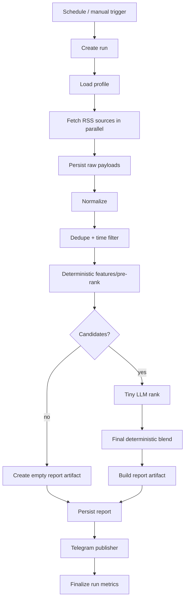
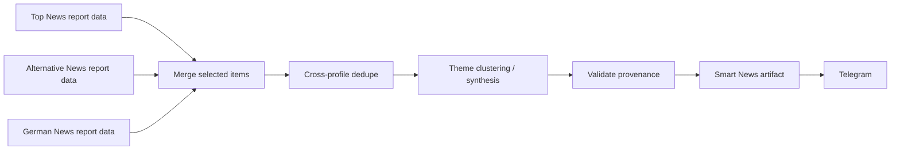
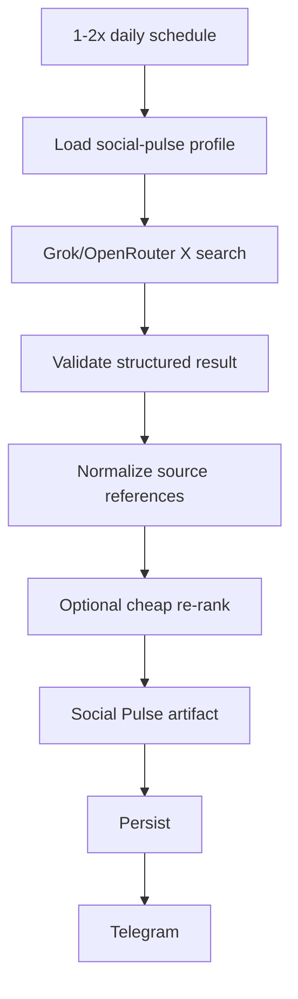

# DailyDash Modernization — Pipeline and Orchestration Plan

**Recommended orchestrator:** Windmill  
**Alternative:** n8n with the same application boundaries  
**Design goal:** visually understandable workflows whose steps remain normal, testable code

## 1. Design rule

The workflow engine owns **control flow**. Python owns **business logic**.

A Windmill flow may decide:

- when a pipeline runs,
- which profile is passed in,
- which steps run in parallel,
- retry behavior,
- timeout behavior,
- whether to continue after a source failure,
- which artifact is handed to a publisher.

It must not contain large chunks of ranking, parsing, prompt-building or report-formatting logic.

This distinction is essential. Otherwise “modernizing into n8n/Windmill” simply moves the old monolithic scripts into graphical boxes.

## 2. Logical layers

```text
TRIGGERS
  schedule / manual / API
       |
       v
ORCHESTRATION
  Windmill flow
       |
       +--------------------+
       |                    |
       v                    v
RETRIEVAL               RETRIEVAL
 RSS / APIs              Grok X search
       |                    |
       +----------+---------+
                  v
              PERSIST RAW
                  |
                  v
              NORMALIZE
                  |
                  v
          DEDUPE / ELIGIBILITY
                  |
                  v
         DETERMINISTIC PRE-RANK
                  |
                  v
            TINY LLM RANK
                  |
                  v
           OPTIONAL SYNTHESIS
                  |
                  v
             REPORT ARTIFACT
              /          \
             v            v
         Telegram      JSON/Markdown
```

## 3. Pipeline interface

Every executable step should look conceptually like this:

```python
def main(input: StepInput) -> StepOutput: ...
```

Inputs and outputs are Pydantic models serializable to JSON. Large data is never passed through orchestration JSON; it is passed by object-store reference.

Example:

```json
{
  "run_id": "01J...",
  "profile": "news-top",
  "input_ref": "s3://dailydash-private/normalized/news-top/2026/08/25/...json",
  "item_count": 47
}
```

This prevents workflow-engine state from becoming the data lake.

## 4. Shared news pipeline

### 4.1 Profiles

There are at least three first-class news products:

1. `news-top`
2. `news-alternative`
3. `news-german`

All execute the same code with different configuration.

Suggested profile schema:

```yaml
id: news-top
pipeline: news
language: en
lookback_hours: 6
output_limit: 10
candidate_limit: 50

sources:
  config: sources/top.yaml

eligibility:
  minimum_title_length: 12
  require_timestamp: false
  dedupe_similarity: 0.92

features:
  keyword_set: market-global
  source_weights: true

ranking:
  strategy: llm
  model_alias: rank-cheap
  prompt: news-top-v1
  weights:
    relevance: 0.35
    market_impact: 0.30
    novelty: 0.20
    urgency: 0.15

presentation:
  template: telegram-news-v1
  language: en
```

Alternative/German profiles change source sets, language and ranking rubric, not the execution code.

### 4.2 Windmill flow



### 4.3 Why an LLM after deterministic pre-ranking

The deterministic stage is excellent at:

- deleting stale data,
- source filtering,
- obvious noise,
- duplicate handling,
- reducing 500 items to 40–60.

It is weak at deciding whether one headline is genuinely more important than another.

The LLM stage should therefore see only the small candidate set and return structured judgments. This keeps cost, latency and nondeterminism bounded.

### 4.4 Ranking response schema

```json
{
  "items": [
    {
      "id": "...",
      "relevance": 0,
      "market_impact": 0,
      "novelty": 0,
      "urgency": 0,
      "noise": 0,
      "reason": "..."
    }
  ]
}
```

Use integer dimensions such as 0–4. Small discrete scales are easier to test than asking the model for pseudo-precise `0.873` values.

The final score is computed by application code, not by the model.

## 5. Smart News pipeline

Smart News should run after relevant news profiles have produced artifacts.



### Smart News rules

- consume selected/ranked items, not the entire raw feed universe,
- retain supporting item IDs for every synthesized theme,
- forbid unsupported claims in the output contract,
- allow 3–5 themes,
- prefer cross-source/cross-market developments,
- preserve the useful macro emphasis from the current `report_news_smart.py`,
- do not perform fresh retrieval inside synthesis.

The synthesis call may use a somewhat stronger model than the tiny ranker because it runs only once or a few times daily. Keep it behind the `synthesize-news` alias.

## 6. X / social pulse pipeline

The public replacement for the current X subsystem is a search-backed retrieval adapter.

### Goal

Produce one compact “social pulse” once or twice a day from:

- a configurable set of X handles,
- configured topics/keywords,
- a defined time range,
- Grok's native X search via OpenRouter.

### Flow



### Example profile

```yaml
id: social-pulse
pipeline: grok-social
runs_per_day: 2
model_alias: social-search

search:
  handles:
    - example_handle_1
    - example_handle_2
  topics:
    - central banks
    - rates
    - oil
    - geopolitics
    - large equity moves
  max_points: 8
  lookback_hours: 12

output:
  include_sources: true
  include_quotes: false
```

No X credentials exist anywhere in the project.

### Adapter compatibility requirement

OpenRouter's APIs for server-side search are evolving. Implement `GrokSocialRetriever` behind a contract and add an integration test proving:

- X search is actually used,
- source references are returned,
- date/handle restrictions behave as expected,
- actual search-call count is exposed in usage metadata.

If a specific OpenRouter X-filter mechanism changes, only this adapter changes.

## 7. WallStreetBets pipeline

### Retrieval

Retain the current good idea of combining:

- hot,
- rising,
- new,
- top/day.

Normalize and dedupe by stable Reddit post ID rather than URL where available.

### Deterministic feature stage

Keep useful numerical features:

- age,
- comments,
- Reddit score,
- comments/hour,
- score/hour,
- listing memberships,
- detected tickers.

Do not let the activity formula directly determine final rank.

### Tiny-LLM ranker rubric

For each candidate judge 0–4:

- `market_signal`: contains actual market/security information or thesis,
- `specificity`: concrete ticker/event/thesis rather than generic sentiment,
- `novelty`: appears meaningfully new,
- `discussion_quality`: engagement is about the thesis rather than meme noise,
- `actionability`: useful to a market observer,
- `noise`: meme/gain-loss/daily-thread/context-free content.

Final score example:

```text
0.25 * market_signal
+ 0.20 * specificity
+ 0.20 * novelty
+ 0.15 * discussion_quality
+ 0.10 * actionability
+ 0.10 * normalized_activity
- 0.30 * noise
```

The weights are configuration and should be benchmarked.

### Output

The final Telegram report should show:

- a short “what is actually being discussed” overview,
- top themes/tickers derived only from selected posts,
- top selected posts with basic activity metadata.

## 8. Polymarket pipeline

### Retrieval

Fetch active liquid markets and recent trade activity as today.

### Deterministic candidate generation

Use:

- minimum liquidity,
- recent volume/trades,
- closed state,
- broad category deny rules,
- duplicate/event-family collapsing.

Cut to about 30–50 candidates.

### Tiny-LLM rubric

Judge 0–4:

- `macro_relevance`,
- `cross_asset_impact`,
- `information_value`,
- `event_proximity`,
- `specificity`,
- `noise`.

The model ranks *editorial usefulness*, not outcome probability.

### Final ranking

Blend semantic score with a bounded activity score. Do not allow raw volume to dominate by several orders of magnitude; normalize/log-transform activity first.

Example:

```python
activity = 0.6 * log1p(volume_24h) + 0.4 * log1p(recent_trades)
final = 0.75 * semantic_score + 0.25 * normalized(activity)
```

The exact formula should be derived from labelled examples.

## 9. Ranker evaluation pipeline

Ranking quality is important enough to be its own pipeline.

### Private labelled data repository

Use the optional private Git repository for **small, curated evaluation sets only**:

```text
dailydash-evals-data/
├── news-top/
├── news-alternative/
├── news-german/
├── wsb/
└── polymarket/
```

Each case contains candidates and a human preference/grade.

### Evaluation flow

```text
labelled candidate set
  -> candidate ranker A
  -> candidate ranker B
  -> compare against labels
  -> metrics + disagreement report
```

Metrics:

- Precision@K,
- Recall@K where applicable,
- NDCG@K,
- pairwise preference accuracy,
- obvious-noise rate in top K,
- cost/run,
- latency.

This is much more valuable than tuning prompts by looking at one Telegram message.

## 10. Model gateway plan

### Logical aliases

The pipeline configuration references aliases only:

```yaml
models:
  rank-cheap: rank-cheap
  synthesize-news: synthesize-news
  social-search: social-search
```

### Initial candidates

| Alias | Initial model | Purpose |
|---|---|---|
| `rank-cheap` | `openai/gpt-4.1-nano` through OpenRouter | classification/ranking baseline |
| `rank-cheap-alt` | `google/gemini-3.1-flash-lite` | evaluation challenger |
| `social-search` | Grok 4+ through OpenRouter | native web/X search |
| `synthesize-news` | configurable | 3–5 theme synthesis |

### LiteLLM deployment

Expose LiteLLM only on an internal Docker network.

The application gets separate virtual keys, for example:

- `dd-ranker-prod`
- `dd-synthesis-prod`
- `dd-social-prod`

Set independent limits so a bug in social search cannot spend the ranker budget.

Suggested initial guards:

```text
ranker:      <= $5/month
synthesis:   <= $5/month
social:      <= $5/month
```

These are intentionally far above expected use but low enough to cap failures.

Record returned provider/model/usage/cost in every run manifest.

## 11. Cost design

Tiny ranking calls are cheap enough that aggressive hand-written scoring is no longer justified as the final ranker.

Illustrative GPT-4.1 Nano calculation at current OpenRouter list pricing:

- 10k input + 1k output tokens = about $0.0014/call.
- 20 calls/day for 30 days = about $0.84/month.

Actual input should usually be less because descriptions are truncated and candidates are prefiltered.

Illustrative Grok social search:

- 60 runs/month,
- 5k input + 800 output tokens,
- one native search/run,
- current Grok 4.20 pricing as a reference,

is roughly $0.80/month; two searches/run roughly $1.10/month.

The architecture should store measured cost rather than relying on these estimates.

## 12. Presentation layer

Presentation gets a `ReportArtifact`, never raw provider objects.

Implement at least:

### Telegram

- Markdown escaping in one place,
- 4096-character split handling,
- retry policy,
- optional dry run,
- delivery result stored in metadata.

### Markdown

Useful for local inspection and GitHub demos.

### JSON

Canonical machine-readable report representation for tests and future consumers.

A web dashboard can be added later without touching retrieval/ranking.

## 13. Triggering/manual runs

Windmill already provides a UI for manually executing flows with typed inputs. This makes the current Telegram command router unnecessary for the first release.

Recommended first release:

- scheduled runs in Windmill,
- manual runs from Windmill UI,
- Telegram output.

Later options:

- a tiny Telegram command adapter that calls Windmill's API,
- an authenticated HTTP endpoint,
- a small web frontend.

Critically, none of those should launch Python subprocesses directly.

## 14. Failure semantics

A workflow engine becomes valuable only if failure behavior is explicit.

### Source failure

- retry individual source with exponential backoff,
- record source error,
- continue if enough candidates remain.

### Ranker failure

- one retry,
- optional fallback model alias,
- if both fail, use deterministic pre-rank and mark report `degraded=true`.

### Synthesis failure

- do not discard ranked data,
- publish a non-synthesized report or skip Smart News only.

### Telegram failure

- retry delivery separately,
- report artifact remains stored,
- a delivery retry must not re-run retrieval or spend on LLMs again.

This is an important improvement over a monolithic report process.

## 15. Idempotency and replay

Each run has a stable `run_id` and each logical item a stable content/provider ID.

The system should support:

```bash
# conceptual CLI
uv run dailydash run news --profile news-top
uv run dailydash replay --run-id <id> --from rank
uv run dailydash render --run-id <id> --channel markdown
uv run dailydash eval-ranker --dataset wsb-v1 --model rank-cheap-alt
```

A replay from `rank` must reuse stored normalized inputs instead of fetching the Internet again. This is the basis for meaningful model comparisons.

## 16. Suggested Windmill workspace layout

```text
f/dailydash/
├── flows/
│   ├── news
│   ├── smart_news
│   ├── social_pulse
│   ├── polymarket
│   └── wsb
├── scripts/
│   ├── create_run
│   ├── fetch_rss
│   ├── normalize
│   ├── rank_items
│   ├── synthesize
│   ├── publish_telegram
│   └── finalize_run
└── resources/
    ├── postgres
    ├── object_store
    └── model_gateway
```

Prefer scripts imported/deployed from the Git repository rather than editing production code only in the browser.

## 17. Schedules for the first release

Do not reproduce the entire legacy crontab blindly.

Start deliberately:

| Pipeline | Initial cadence |
|---|---|
| Top News | 4–6/day |
| Alternative News | 3–4/day |
| German News | 3–4/day |
| Smart News | 2/day after constituent news runs |
| Social Pulse | 1–2/day |
| Polymarket | 1/day |
| WSB | 1/day on market days |

After a week of run metrics, decide whether extra news runs add meaningful new items or merely cost/network noise.

## 18. If n8n is chosen instead

Keep exactly the same architecture and contracts.

An n8n flow should contain nodes such as:

```text
Schedule
 -> Execute/HTTP: collect
 -> Execute/HTTP: normalize
 -> Execute/HTTP: rank
 -> Execute/HTTP: build artifact
 -> Execute/HTTP: publish
```

Do not implement the ranker prompt, parsing, source adapters and business rules as large n8n Code nodes.

Export workflow JSON into the public repository and document the fact that n8n's richer native source-control environment features are edition-dependent.

Windmill remains the stronger recommendation because it makes “workflow UI + versioned code” the default rather than a discipline you must enforce.

## 19. Acceptance criteria for the architecture

A pipeline is considered correctly migrated only when:

- it can run without Telegram,
- it can run without Windmill through the local CLI/test harness,
- its raw data is outside the public repo,
- its ranker can be swapped by configuration,
- its output can be replayed/rendered without refetching,
- it has a labelled ranking regression test,
- secrets are scoped to the component that needs them,
- every LLM call records cost/usage metadata,
- no host cron entry is required.
