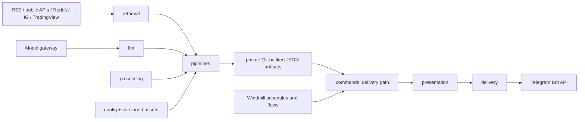

# DailyDash Architecture

> Generated with `ai-craftkit` skill: `archdoc`  
> Source: `https://github.com/stefanrossmeier/daily-dash.git` at commit `e080781f788934b050123bffa686df5ae4faf125`  
> Prompt: `Inspect the repo, create the full documentation in the directory /docs/archdoc`

Last Reviewed Scope: full review
Doc Status: DRAFT
Last Architecture Update: 2026-08-30T00:00:00Z
Updated By: agent
Source Basis: code scan, contract tests, configuration, deployment files

## Purpose And Scope

DailyDash is a layered, configuration-driven reporting application. It owns data acquisition, normalized contracts, deterministic transformation, limited structured LLM work, immutable artifact creation, report rendering, and Telegram delivery. Windmill is a separate orchestration runtime that schedules the flows and injects operational values.

## System Context



## Static Layers And Ownership

| Layer | Owns | Must not own |
|---|---|---|
| `config` | YAML schema validation, profile/source/schedule loading, config paths. | Retrieval or delivery behavior. |
| `contracts` | Typed internal/persisted data schema. | I/O and orchestration. |
| `retrieval` | HTTP/API/feed acquisition and external-data normalization. | Processing, storage, presentation, delivery. |
| `llm` | Prompt assets, gateway requests, response schemas, local output validation, model traces. | Retrieval, processing, storage, presentation, delivery. |
| `processing` | Deterministic policy, scores, deduplication, eligibility, transformations. | External I/O and report rendering. |
| `storage` | Immutable JSON artifact reads/writes behind pipeline-specific store interfaces. | External data collection and rendering. |
| `pipelines` | Composition of retrieval, model adapters, processing, and storage. | Rendering/delivery. |
| `presentation` | Rendering a persisted domain document to a `ReportArtifact`. | Retrieval, processing, LLM, storage, pipelines, delivery. |
| `delivery` | Telegram Bot API transport. | Report selection or rendering. |
| `commands` | Runtime CLI boundary. `run` invokes pipelines; `deliver` reads an artifact then renders/sends. | Cross-layer policy. |

These dependency constraints are verified by [tests/contract/test_architecture_boundaries.py](../../tests/contract/test_architecture_boundaries.py).

## Pipeline Shape

All report families follow the same broad arrangement, with model stages only where profile logic requires them:

```text
configuration/assets -> retrieval -> normalized contracts -> optional LLM -> deterministic processing -> immutable JSON artifact
```

The pipeline is intentionally separated from reader presentation. A command loads the persisted artifact for `deliver`, applies display limits and formatting, then invokes the Telegram adapter. Windmill surrounds that application boundary with persistence and delivery orchestration.

## Report Families

| Family | Retrieval boundary | Core processing / model boundary | Artifact store |
|---|---|---|---|
| News | RSS feeds | LLM headline ranking, dedupe, event selection, optional Top News policy/backfill. | `JsonNewsRunStore` |
| Smart News | RSS feeds with retry policy | LLM themes then versioned macro-theme policy. | `JsonSmartNewsRunStore` |
| Markets | Yahoo Finance via `yfinance` | Last/previous-close and all-time-high calculations. | `JsonFileMarketSnapshotStore` |
| Futures | TradingView via compatible `tvDatafeed` | Quote status/change calculations. | `JsonFileFuturesSnapshotStore` |
| Weekend Markets | IG public pages | Bid/ask/change parsing and issue collection. | `JsonFileWeekendMarketSnapshotStore` |
| Yields | FRED, Bundesbank, ECB CSV endpoints | Levels, aligned spreads, curve regime. | `JsonFileYieldSnapshotStore` |
| WSB | Reddit OAuth | Model relevance plus deterministic activity eligibility. | `JsonWsbRunStore` |
| Polymarket | Public Gamma/Data APIs | Model signal eligibility plus deterministic hot-event lane. | `JsonPolymarketRunStore` |
| X Watchlist | Gateway-backed Grok native X search | Citation/handle/time-window validation, then model ranking. | `JsonXWatchlistRunStore` |

## Configuration And Asset Boundaries

- `config/profiles/*.yaml` chooses one pipeline and references a source set.
- `config/sources/*.yaml` owns source membership, instrument lists, endpoint URLs, and account handles.
- `config/schedules.yaml` is the schedule source of truth. It is loaded by pipelines to derive exact retrieval windows and rendered into Windmill schedule files.
- `assets/prompts/` contains versioned model instruction manifests and text. The loader validates paths and records SHA-256 hashes in model traces.
- `assets/policies/` stores substantive deterministic policy. Smart News records policy identity and SHA-256 in its artifact.
- `config/model-gateway.yaml` keeps model choice/retry policy outside application code through aliases such as `rank-cheap` and `x-retrieve`.

## Data Ownership

| Data | Owner / location | Constraint |
|---|---|---|
| Source and application configuration | Public repository `config/`. | Typed and cross-validated; no credentials. |
| Prompt/policy behavior | Public repository `assets/`. | Versioned and traceable. |
| Runtime secrets | Private local secret files and Windmill secret variables. | Not in source, image, config, docs, logs, or artifacts. |
| Generated report data | Separate private Git repository mounted at `/data/daily-dash-data`. | JSON is immutable; public source checkout is not a data sink. |
| Orchestration history/logs | Windmill and container volumes. | Retention/backups not verified. |

Artifact stores name files using UTC timestamp plus a short run-id suffix and reject an existing file. For market-style documents, artifacts retain both raw source facts and processed report data. Model-backed documents retain candidate/selection diagnostics and model traces.

## Architectural Constraints

1. Production flow order is `run -> persist -> deliver`.
2. Windmill orchestrates but does not duplicate DailyDash business logic.
3. Model providers are reached only through the model gateway; application code does not read the root provider key.
4. Deterministic selection and presentation policy remain separate from LLM output.
5. Presentation limits cannot change the semantic candidate/result universe.
6. One unavailable external record should normally become a recorded issue rather than erase an otherwise usable report; pipelines do fail when all required sources are unavailable.

## Security And Trust Boundaries

External feeds, HTML, API data, model responses, and provider metadata are untrusted inputs. Pydantic contracts enforce structured inputs/outputs at configuration and model boundaries. The X Watchlist applies additional allowed-handle, canonical-URL, exact-window, duplicate, and optional citation-evidence checks before ranking.

The persistence script is a particularly important boundary: it validates relative output paths, requires a Git repository/remote/branch, uses a temporary deploy-key file with pinned GitHub host key, rejects pre-staged data, detects remote divergence, and serializes writers through a Git-directory lock.

## Interface Ownership

The application exposes a package CLI, report-specific module CLIs, a local model-gateway HTTP client contract, and Windmill script/flow schemas. Detailed command arguments, HTTP requests, artifact contracts, and compatibility notes are owned by [API_SURFACE.md](API_SURFACE.md), not repeated here.

## Architecture Confidence

| Claim | Evidence | Status |
|---|---|---|
| Layers have explicit dependency constraints. | Architecture-boundary contract test and package layout. | verified |
| Production workflows persist before delivery. | Flow YAML and focused Windmill contract tests. | verified |
| Artifacts are typed and immutable per output filename. | Pydantic contracts and `storage/` implementations. | verified |
| Private Git storage can later be replaced. | Storage protocols separate persistence from pipelines. | verified |
| Windmill retry policy or production worker scaling is suitable for all workloads. | Compose file has worker replicas, but execution behavior was not run. | uncertain |

## High-Impact Changes

- Adding a report profile requires a typed profile/source schema, schedule entry, command/pipeline path, artifact store, Windmill run/persist/deliver flow, and focused contract coverage.
- Changing contracts, prompts, policies, or model schemas affects persisted artifact compatibility and replay/evaluation value; introduce versions rather than silently repurposing historical meaning.
- Changing a retrieval adapter can alter source semantics or failure modes. Preserve provenance fields and partial-failure behavior.
- Replacing Git-backed storage must preserve the pipeline storage protocol, artifact immutability, and persistence-before-delivery invariant.

## Known Unknowns

- A production deployment topology beyond the local Compose/VPS-oriented guidance was not identified.
- No database/object-store migration implementation was found.
- Backup, retention, monitoring alert rules, and disaster-recovery runbooks were not found in the inspected files.
